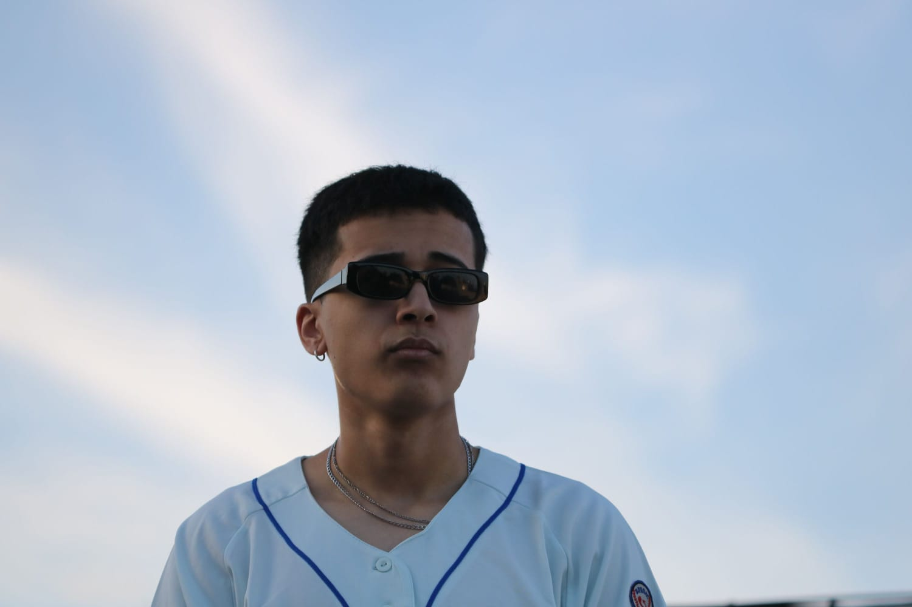

## Mi presentacion:Santino Galdin

### Hola me llamo Santino Nahuel Galdin,tengo 18 años

##### Estudie en la escuela secundaria Marta Sierra en ituzaingo,elegi esta carrera ya que me gusta mucho todo lo que es el mundo de la computacion,la tecnologia y la programacion,este ya es mi segundo año en esta carrera,mi idea es hacer la licenciatura por el momento pero mas adelante ire viendo que es lo que finalmente termino haciendo.
